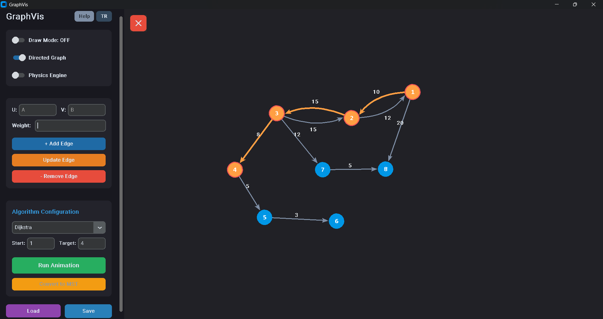
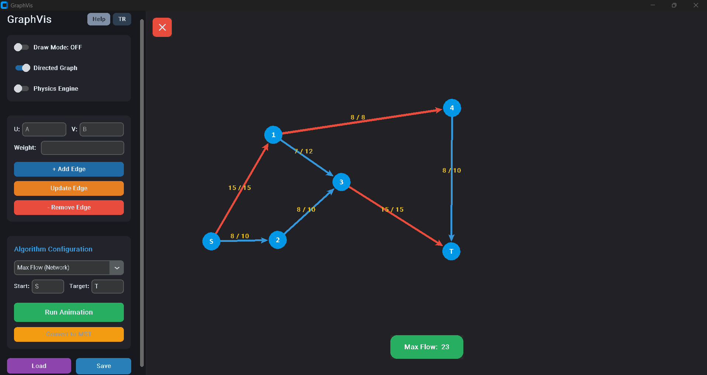
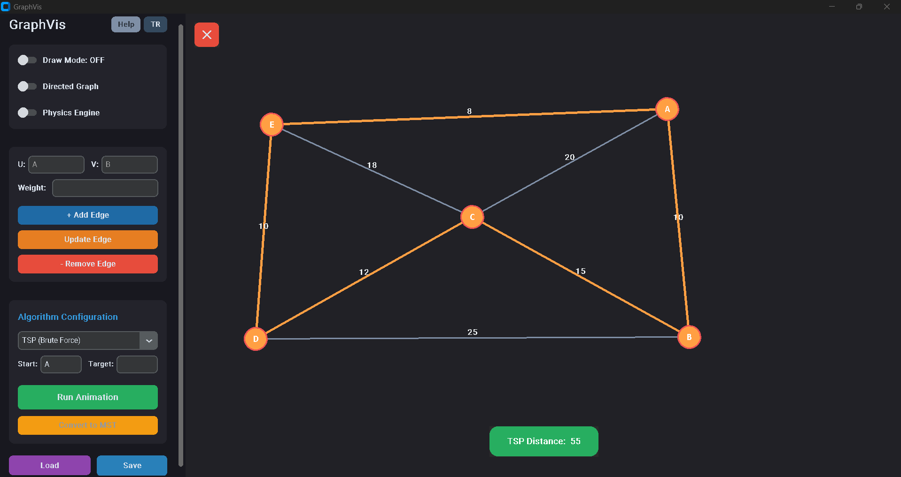

# GraphVis

**GraphVis** is a fully interactive, state-of-the-art Graph Theory and Algorithm visualization engine developed entirely in Python. 

Unlike standard implementations that rely on heavy external graph libraries (like NetworkX), this project is built **from scratch**. It features a custom backend architecture including bespoke Hash Maps, sorting algorithms, and Disjoint Set (Union-Find) data structures, all wrapped in a highly responsive, modern GUI.

## ✨ Key Features

* **Live Physics Engine:** Nodes dynamically arrange themselves using a custom force-directed physics engine (repulsive and spring forces).
* **Interactive Draw Mode:** Fully interactive Canvas. Click to add nodes, drag to connect edges, right-click to delete, and double-click to rename.
* **Bezier Curves:** Intelligent bidirectional edge rendering using Bezier curves to prevent overlapping paths on directed graphs.
* **Responsive Studio UI:** Built with `CustomTkinter`. Features a collapsible sidebar (hamburger menu), floating toast notifications, and dynamic canvas resizing.
* **Bilingual Support (i18n):** Real-time language switching between English (EN) and Turkish (TR) without restarting the application.
* **Data Persistence:** Save your custom-built networks to a `.json` file and load them instantly.

---

## 🧠 Supported Algorithms & Demos

### 1. Pathfinding (Dijkstra, A* Search, BFS, DFS)
Finds the shortest path between nodes. Demonstrates bidirectional **Bezier curve** rendering.

### 2. Network Flow (Ford-Fulkerson / Edmonds-Karp)
Visualizes maximum data/liquid flow through a network. Automatically highlights bottleneck edges (red) and visualizes capacity ratios (e.g., `8/10`).

### 3. Routing Optimization (Traveling Salesperson Problem)
Calculates the most efficient closed-loop route to visit all nodes. Supports both **Nearest Neighbor** (Heuristic) and **Brute Force** (Exact) methods.

### 4. Minimum Spanning Tree (MST)
Converts complex networks into an optimal tree structure using **Prim's** or **Kruskal's** algorithms (optimized with custom Path Compression & Rank Checking).

---

## 📂 Project Architecture (Under the Hood)

This project strictly avoids shortcuts. Everything is hand-coded:
* `graph.py`: The core math engine and algorithm implementations.
* `graphvis.py`: The frontend UI, render engine, and event listeners.
* `mydict.py`: A custom Hash Map structure utilized for adjacency lists.
* `unionfind.py`: Disjoint Set structure crucial for Kruskal's algorithm.
* `sorting.py`: Custom sorting implementations used internally by the engine.

## 🛠️ How to Run

1. Clone the repository:

  git clone [https://github.com/kuzey-gorgec/GraphVis.git](https://github.com/kuzey-gorgec/GraphVis.git)

2. Clone the repository:Install the required UI library:

  pip install customtkinter

3. Clone the repository:Run the application:

  python main.py

Author
Umut Kuzey Görgeç Computer Engineering Student | Sakarya University of Applied Sciences

License
This project is licensed under the MIT License.